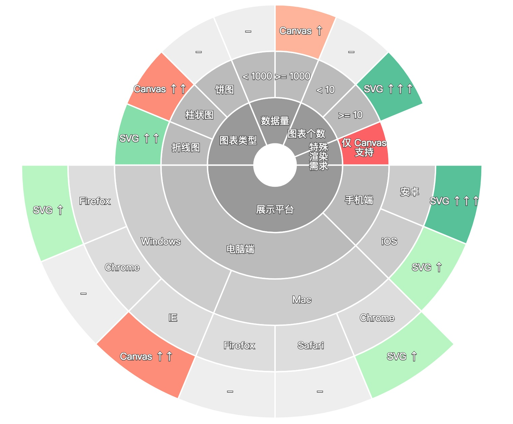

# ECharts 数据可视化基础

- - - - -
<!-- .slide: style="background-image:url('./img/echarts4.png');" -->
2018年1月16日，百度发布了旗下知名开源产品 ECharts 的最新大版本 4.0，新版本在产品的性能、功能、易用性等各个方面进行了全面提升。

上一次版本更新可追溯到2016年1月12日，当时发布了3.0，带来了箱形图等数据类型。
> 被国家统计局、国家电网、阿里、腾讯、小米等所采用

附:[开源地址](https://github.com/ecomfe/echarts) 以及 [官方文档](http://echarts.baidu.com/)
- - - - -
开源的数据可视化产品主要有D3.js,百度ECharts，阿里G2等。从方便程度来讲，个人建议使用ECharts。

本章主要是基于[官方教程](http://echarts.baidu.com/tutorial.html#5%20%E5%88%86%E9%92%9F%E4%B8%8A%E6%89%8B%20ECharts)针对可视化技术做讲解，对于各类型图表的应用场景不做探讨。
- - - - -
# 第一个图表
```html
<div id="chart" style="width:100%;height:500px;"></div>
<script src="https://cdn.bootcss.com/echarts/4.0.0/echarts.min.js"></script>
<script src="https://cdn.bootcss.com/echarts/4.0.0/extension/dataTool.min.js"></script>
<script>
    const chart = echarts.init(document.querySelector('#chart'));
    chart.setOption({
        title: {
            text: 'ECharts 入门示例'
        },
        tooltip: {},
        legend: {
            data: ['销量']
        },
        xAxis: {
            data: ["衬衫", "羊毛衫", "雪纺衫", "裤子", "高跟鞋", "袜子"]
        },
        yAxis: {},
        series: [{
            name: '销量',
            type: 'bar',
            data: [5, 20, 36, 10, 10, 20]
        }]
    })
</script>
```
[点击这里查看示例](./markdown/demo/chart01.html)
- - - - -
# canvas 与 svg
> 从ECharts4.0以后开始正式支持svg绘图，导出的图片可以以矢量格式存在，清晰度高许多，同时在对特效要求不高的场景，svg占用较少内存。SVG渲染折线图和饼图的效率更高，而由于Canvas渲染矩形的效率很高，所以柱状图使用Canvas渲染的效率高于SVG。

```js
const chart = echarts.init(document.querySelector('#chart'),null , {
        renderer: 'svg'
    });
```



[点击这里查看示例](./markdown/demo/chart02.html)
推荐阅读: [Canvas or SVG？一张好图，两手准备，就在 ECharts 4.0](https://zhuanlan.zhihu.com/p/33093211)
- - - - -
# 曲线图
```js
series: [{
    name: '销量',
    type: 'bar',
    data: [5, 20, 36, 10, 10, 20]
}]

series: [{
    name: '销量',
    type: 'line',
    data: [5, 20, 36, 10, 10, 20]
}]
```
平滑曲线
> smooth:true

[点击这里查看示例](./markdown/demo/chart03.html)并试着调整更多的功能。
- - - - -
# 数据异步加载
在异步的完成事件中渲染图像。
```js
$.get('data.json').done(function (data) {
    myChart.setOption({
        title: {
            text: '异步数据加载示例'
        },
        tooltip: {},
        legend: {
            data:['销量']
        },
        xAxis: {
            data: ["衬衫","羊毛衫","雪纺衫","裤子","高跟鞋","袜子"]
        },
        yAxis: {},
        series: [{
            name: '销量',
            type: 'bar',
            data: [5, 20, 36, 10, 10, 20]
        }]
    });
});
```
- - - - -
先设置空图表，再添加数据
```js
myChart.setOption({
    title: {
        text: '异步数据加载示例'
    },
    tooltip: {},
    legend: {
        data:['销量']
    },
    xAxis: {
        data: []
    },
    yAxis: {},
    series: [{
        name: '销量',
        type: 'bar',
        data: []
    }]
});

// 异步加载数据
$.get('data.json').done(function (data) {
    // 填入数据
    myChart.setOption({
        xAxis: {
            data: data.categories
        },
        series: [{
            // 根据名字对应到相应的系列
            name: '销量',
            data: data.data
        }]
    });
});
```
- - - - -
# 图表缩放
```js
dataZoom: [
         {
            show: true,
            realtime: true,
            start: 30,
            end: 70
        },
        {
            type: 'inside',
            realtime: true,
            start: 30,
            end: 70
        }
    ],
```
- - - - -
# 鼠标点击事件
```js
myChart.on('click',function(param){
    console.log(param);
    window.open('https://www.baidu.com/s?wd=' + encodeURIComponent(params.name));
})
```
- - - - -
# dataset
> ECharts 4.0新增功能

以往的数据配置方式如下
```js
option= {
    xAxis: {
        type: 'category',
        data: ['Matcha Latte', 'Milk Tea', 'Cheese Cocoa', 'Walnut Brownie']
    },
    yAxis: {},
    legend:{},// 4.0起可以不指定其中的data
    series: [
        {
            type: 'bar',
            name: '2015',
            data: [89.3, 92.1, 94.4, 85.4]
        },
        {
            type: 'bar',
            name: '2016',
            data: [95.8, 89.4, 91.2, 76.9]
        },
        {
            type: 'bar',
            name: '2017',
            data: [97.7, 83.1, 92.5, 78.1]
        }
    ]
}
```
- - - - -
```sql
SELECT
	CONVERT (VARCHAR(4), produceDate, 112) 生产日期 productType 品种,
	SUM (
		CASE
		WHEN productType = '103-G-A' THEN
			1
		ELSE
			0
		END
	) '103-G-A',
	SUM (
		CASE
		WHEN productType = '103-G-B' THEN
			1
		ELSE
			0
		END
	) '103-G-B',
	SUM (
		CASE
		WHEN productType = '103-G-C' THEN
			1
		ELSE
			0
		END
	) '103-G-C'
FROM
	qualityTable
GROUP BY
	CONVERT (VARCHAR(4), produceDate, 112),
	productType
ORDER BY
	1,	2
```
- - - - -
# 开发中常见的数据查询
```SQL
SELECT
	a.产品名称,
	CONVERT (VARCHAR, a.结束时间, 112) AS 完成日期,
	round(AVG(a.好品率), 2) AS 平均好品率
FROM
	dbo.view_paper_quality AS a
WHERE
	CONVERT (VARCHAR, a.结束时间, 112) BETWEEN ?
AND ?
AND a.纸张总数 > 1000
GROUP BY
	CONVERT (VARCHAR, a.结束时间, 112),
	产品名称
ORDER BY
	1,
	2
```
- - - - -
[api返回数据示例](http://localhost/DataInterface/Api?ID=144&M=3&tstart=20170101&tend=20170131&cache=10)
```JSON
    {
	"timing": "95.432ms",
	"rows": 7,
	"cols": 3,
	"header": [{
		"title": "产品名称"
	}, {
		"title": "完成日期"
	}, {
		"title": "平均好品率"
	}],
	"data": [
		["G-3A", "20170110", "63.32"],
		["G-3A", "20170111", "95.14"],
		["G-3A", "20170112", "90.25"],
		["G-3A", "20170113", "93.66"],
		["G-4A", "20170110", "83.32"],
		["G-4A", "20170111", "92.14"],
		["G-4A", "20170112", "96.25"],
		["G-4A", "20170113", "91.66"],
		["G-4A", "20170114", "90.45"],
		["G-4A", "20170115", "93.16"],
		["G-4A", "20170116", "93.39"]
	],
	"title": "各品种每天平均好品率变化图",
	"source": "数据来源:质量综合管理系统"
}
```
- - - - -
# 如何封装？
- 指定第A列为数据序列，第B列为X轴，第C列为Y轴。
- 遍历数组，取A/B列的数值并去重后分别存储。
- 根据A/B列的数据构建series所需的数据。

- - - - -
# ECharts 4.0中的dataset
```js
option = {
    legend: {},
    tooltip: {},
    dataset: {
        // 提供一份数据。
        source: [
            ['product', '2015', '2016', '2017'],
            ['Matcha Latte', 43.3, 85.8, 93.7],
            ['Milk Tea', 83.1, 73.4, 55.1],
            ['Cheese Cocoa', 86.4, 65.2, 82.5],
            ['Walnut Brownie', 72.4, 53.9, 39.1]
        ]
    },
    // 声明一个 X 轴，类目轴（category）。默认情况下，类目轴对应到 dataset 第一列。
    xAxis: {type: 'category'},
    // 声明一个 Y 轴，数值轴。
    yAxis: {},
    // 声明多个 bar 系列，默认情况下，每个系列会自动对应到 dataset 的每一列。
    series: [
        {type: 'bar'},
        {type: 'bar'},
        {type: 'bar'}
    ]
}
```
> 数据的这种组织方式可能与后端输出的仍然有些不符

- - - - -
# 另一种形式
```js
  let data = {
    "header": [{
      "title": "产品名称"
    }, {
      "title": "完成日期"
    }, {
      "title": "平均好品率"
    }],
    "data": [
      ["G-3A", "20170110", "63.32"],
      ["G-3A", "20170111", "95.14"],
      ["G-3A", "20170112", "90.25"],
      ["G-3A", "20170113", "93.66"],
      ["G-4A", "20170110", "83.32"],
      ["G-4A", "20170111", "92.14"],
      ["G-4A", "20170112", "96.25"],
      ["G-4A", "20170113", "91.66"],
      ["G-4A", "20170114", "90.45"],
      ["G-4A", "20170115", "93.16"],
      ["G-4A", "20170116", "93.39"]
    ]
  };
  ```
- - - - -
```js
  let header = data.header.map(item => item.title);
  let source = [header, ...data.data];
  let xAxis = '完成日期',
    yAxis = '平均好品率';
  var option = {
    dataset: {
      source
    },
    tooltip: {},
    yAxis: {},
    xAxis: { type: 'category' },
    series: [{
      type: 'bar',
      encode: {
        x: xAxis,// 将 xAxis 列映射到 X 轴。
        y: yAxis// 将 yAxis 列映射到 Y 轴。
      }
    }]
  };
```
> 此时仍要拼接数组

- - - - -
# dataset的维度
[官网的说明在此](http://echarts.baidu.com/tutorial.html#%E6%95%B0%E6%8D%AE%E9%9B%86%EF%BC%88dataset%EF%BC%89)
>常用图表所描述的数据大部分是“二维表”结构，上述的例子中，我们都使用二维数组来容纳二维表。现在，当我们把系列（series）对应到“列”的时候，那么每一列就称为一个“维度（dimension）”，而每一行称为数据项（item）。反之，如果我们把系列（series）对应到表行，那么每一行就是“维度（dimension）”，每一列就是数据项（item）。
> 
> 维度可以有单独的名字，便于在图表中显示。维度名（dimension name）可以在定义在 dataset 的第一行（或者第一列）。例如上面的例子中，'score'、'amount'、'product' 就是维度名。从第二行开始，才是正式的数据。dataset.source 中第一行（列）到底包含不包含维度名，ECharts 默认会自动探测。当然也可以设置 dataset.sourceHeader: true 显示声明第一行（列）就是维度，或者 dataset.sourceHeader: false 表明第一行（列）开始就直接是数据。

- - - - -
```js
  let header = data.header.map(item => item.title);
  // let source = [header, ...data.data];
  let xAxis = '完成日期',
    yAxis = '平均好品率';
  var option = {
    dataset: {
      source: data.data,
      dimensions: header,
      sourceHeader: false
    },
    tooltip: {},
    yAxis: {},
    xAxis: { type: 'category' },
    series: [{
      type: 'bar',
      encode: {
        // 将 xAxis 列映射到 X 轴。
        x: xAxis,
        // 将 yAxis 列映射到 Y 轴。
        y: yAxis
      }
    }]
  };
```
> 如果把“完成日期”、“平均好品率”这些作为图像配置参数仍显得不便，ECharts的dataset还支持另一种形式。

- - - - -
```js
  let header = data.header.map(item => item.title);
  var option = {
    dataset: {
      source: data.data,
      dimensions: header,
      sourceHeader: false
    },
    tooltip: {},
    yAxis: {},
    xAxis: { type: 'category' },
    series: [{
      type: 'bar',
      encode: {
        x: 1,
        y: 2
      }
    }]
  };

```
- - - - -
# 数据的引用

可以同时定义多个 dataset。系列可以通过 series.datasetIndex 来指定引用哪个 dataset。例如：
```js
var option = {
    dataset: [{
        // 序号为 0 的 dataset。
        source: [...],
    }, {
        // 序号为 1 的 dataset。
        source: [...]
    }, {
        // 序号为 2 的 dataset。
        source: [...]
    }],
    series: [{
        // 使用序号为 2 的 dataset。
        datasetIndex: 2
    }, {
        // 使用序号为 1 的 dataset。
        datasetIndex: 1
    }]
}
```
- - - - -
# 封装数据转换
```js
  let getBarSettings = (option, data) => {
    function uniq(arr) {
      return Array.from(new Set(arr))
    }
    let header = data.header.map(item => item.title);
    let legend = data.data.map(item => item[option.legend]);
    legend = uniq(legend);
    let series = [];
    let dataset = legend.map((legendItem, i) => {
      series.push({
        name: legendItem,
        type: option.type,
        encode: {
          x: option.x,
          y: option.y
        },
        datasetIndex: i
      });
      return {
        source: data.data.filter(item => item[option.legend] == legendItem),
        dimensions: header,
        sourceHeader: false
      }
    });
    return { dataset, series };
  }
  ```
- - - - -
```js
  let options = {
    legend: 0,
    x: 1,
    y: 2,
    type: 'bar'
  }
  
  let settings = getBarSettings(options, originalData);
  
  var option = {
    dataset: settings.dataset,
    legend: {},
    tooltip: {},
    yAxis: {},
    xAxis: { type: 'category' },
    series: settings.series
  };

```
- - - - -
# 增强鲁棒性
```js

  let getBarSettings = options => {
    const haveLegend = Reflect.has(options, 'legend');
    let option = Object.assign({
      x: haveLegend ? 1 : 0,
      y: haveLegend ? 2 : 1,
      type: 'bar'
    }, options);


    let data = option.data;
    let header = data.header.map(item => item.title);

    if (!haveLegend) {
      return {
        dataset: {
          source: data.data,
          dimensions: header
        },
        series: [{
          type: option.type,
          encode: {
            x: option.x,
            y: option.y
          },
        }]
      }
    }
    // 处理正常情况的数据配置
  }
```
- - - - -
# 关于formatter
```js
itemStyle: {
    normal: {
        borderColor: 'rgba(0,0,0,0)',
        borderWidth: 1,
        label: {
            show: true,
            position: 'inner',
            formatter: function (param){
                console.log(param)            
            },
            textStyle: {
                fontSize: 12
            },
        }
    }
}
```
- - - - -
# color
颜色主题，[可以参考这里的配色](./markdown/demo/adobecc/index.html)选取自己喜欢的颜色。
- - - - -
# toolbox
```js
toolbox: {
    feature: {
        dataZoom: {
            yAxisIndex: 'none'
        },
        restore: {},
        saveAsImage: {}
    }
},
```
- - - - -
# 各类常见可视化图形
## 堆叠图
```js
let dataset = legend.map((legendItem, i) => {
  let seriesItem = {
    name: legendItem,
    type: option.type,
    encode: {
      x: option.x,
      y: option.y
    },
    datasetIndex: i
  };
  if (Reflect.has(option, 'stack')) {
    seriesItem.stack = option.stack;
  }
  series.push(seriesItem);
  return {
    source: data.data.filter(item => item[option.legend] == legendItem),
    dimensions: header
  }
});
let options = {
    legend: 0,
    x: 1,
    y: 2,
    stack: '合计',
    type: 'bar',
    data: originalData
}
```
> 当不使用堆叠图时，stack值默认为false

- - - - -
```js
let dataset = legend.map((legendItem, i) => {
      let seriesItem = {
        name: legendItem,
        type: option.type,
        encode: {
          x: option.x,
          y: option.y
        },
        datasetIndex: i,
        stack: Reflect.get(option, 'stack')
      };
      series.push(seriesItem);
      return {
        source: data.data.filter(item => item[option.legend] == legendItem),
        dimensions: header
      }
    });
    return {
      dataset,
      series
    };
  }
```
- - - - -
# 条形图
交换x,y轴配置
```js
  // 这里options的参数如何配置？
  let options = {
    legend: 0,
    y: 1,
    x: 2,
    type: 'bar',
    data: originalData,
    stack: '合计',
    reverse: true
  }

  let settings = getBarSettings(options, originalData);

  var option = {
    dataset: settings.dataset,
    legend: {},
    tooltip: {},
    yAxis: {},
    xAxis: {
      type: 'category'
    },
    series: settings.series
  };
  if (options.reverse) {
    option.xAxis = {};
    option.yAxis = {
      type: 'category'
    };
  }
```
- - - - -
> 如何通过获取配置参数？
> 方案一,做单独的管理页面配置图形样式并存储配置项于数据库，数据请求按以下方式进行。:
【请求www.yourdomain.com/chart/23】→【读取 id=23 的配置(包含接口id，数据图的配置项等信息)】→【渲染图像】
> 方案2：直接将配置项置于地址栏请求中：
> www.yourdomain.com/chart/23/?type=bar&legend=2&x=0&y=3&reverse=1

```
var qs = require('qs');
// window.location.search.slice(1)
const url = 'www.yourdomain.com/chart/23/?type=bar&legend=2&x=0&y=3&reverse=1';
const search = url.includes('?') ? url.split('?')[1]:'type=bar';
let option = qs.parse(search);
```
```cmd
npm start
{ type: 'bar', legend: '2', x: '0', y: '3', reverse: '1' }
```
推荐阅读：[queryString](https://www.npmjs.com/package/qs)
- - - - -
```js
let qs = require('qs');
let getChartConfig = ()=>{
    let search = window.location.search.slice(1);
    search = search.length ? search:'type=bar';
    return qs.parse(search);
}
```
- - - - -
# 封装图表配置项
> parcel.js 打包 axios,lodash,echarts

[示例url](http://localhost:1234/?type=bar&legend=0&x=1&y=2&smooth=1&max=100&min=70)

[demo源码](https://github.com/realeve/mdSlider/tree/master/markdown/demo/chartConfig)
- - - - -
> 由于queryString变化时，url将重载，所以在实际应用中建议使用hash来传参，这样页面切换时无需加载额外资源，只需重新加载数据并渲染即可。

```js
let getChartConfig = () => {
    // let search = window.location.search.slice(1);
    let search = window.location.hash.slice(1);
    search = search.length ? search : "type=bar";
    return qs.parse(search);
};
```
- - - - -
> [如何监听hash变化？](https://developer.mozilla.org/en-US/docs/Web/Events/hashchange)

```js
let initEvent = chart => {
    window.onresize = () => { chart.resize() }
    window.onhashchange = () => {
        init();
    }
};
```
- - - - -
# 饼图
type:'pie'
- - - - -
# 环形图
type:'pie',
radius:[30,60]
- - - - -
# 玫瑰图
type:'pie',
radius : [20, 110],
roseType : 'radius',
- - - - -
# 散点图
type:'scatter'
- - - - -
# 主题河流图
type:'themeRiver'
- - - - -
# 箱线图
type:'boxPlot'
- - - - -
# 旭日图
type: 'sunburst',
- - - - -
# Q&A