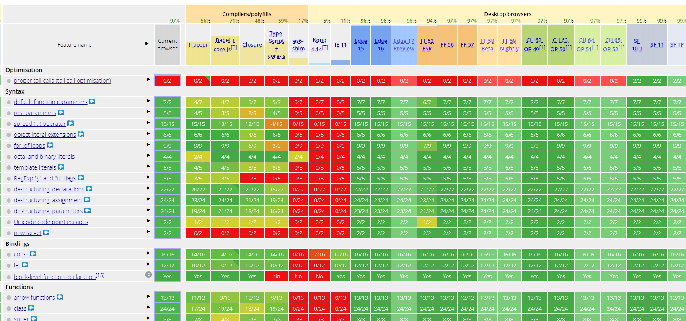
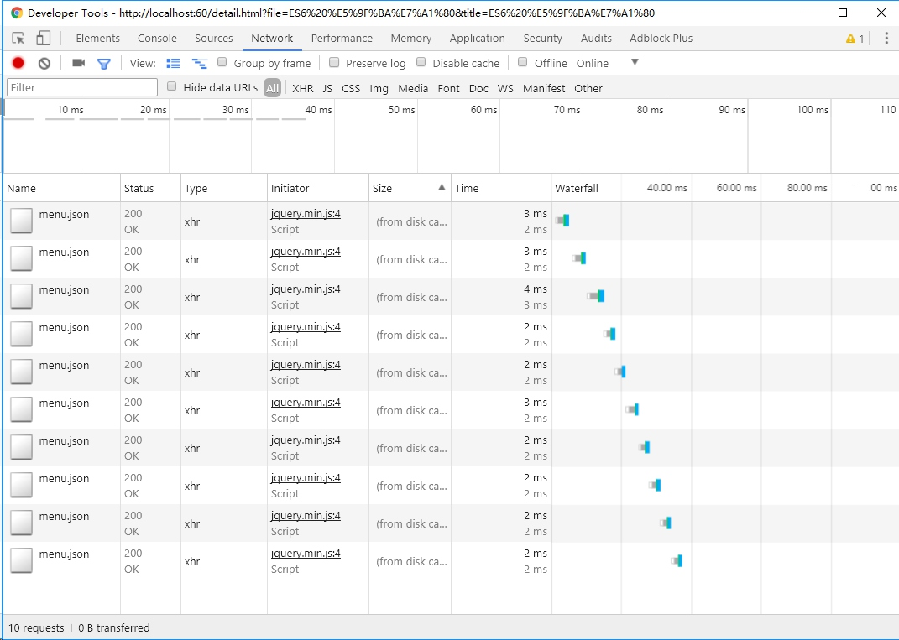
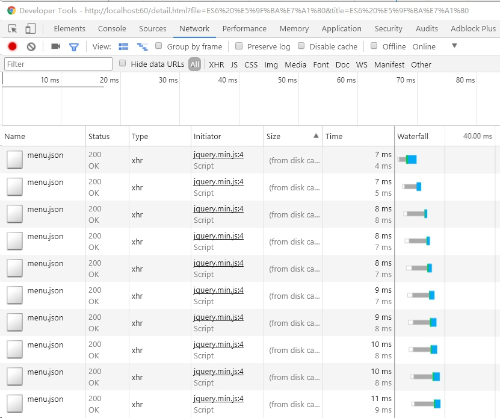

# ES6基础
- - - - -
# ECMAScript 的发展历史
>总的来讲，目前浏览器运行的javascript版本是ES5，2015年6月正式发布了ES6(es2015)，2017年6月正式发布ES7(ES2017)

延伸阅读：[ECMAScript的发展](http://es6.ruanyifeng.com/#docs/intro)

- - - - -
# 浏览器的兼容性
目前几大浏览器对ES6已完美支持，但对行业来讲，有许多特性还需要用Babel转码为ES5方可使用，浏览的兼容情况可点击[这里](http://kangax.github.io/compat-table/es6/)查看。


- - - - -
# 变量定义
```js
var dom = $('#container');
let dom = $('#container');
const PI = 3.1415;
```
> JS 中变量可不定义也可使用，但如果不使用var关键字定义，变量的作用域会提升，污染全局变量，所以在实际使用中是**建议变量在使用前必须定义**。

- - - - -
# 变量的作用域
> let 是块级(花括号或圆括号)作用域，let声明的变量在同一作用域内不可重新声明。

```js
    var a = 2;
    if (true) {
        var a = 3;
    }
    console.log(a);
    // 3
```
```js
    let a = 2;
    if (true) {
        let a = 3;
    }
    console.log(a);
    // 2
``` 
- - - - -
> const表示定义常量，常量不允许修改其值。但常量的内容是数组或对象时，其内容可被修改，但常量本身不能被重新定义。

```js
const PI = 3.1415926;
PI = 2;// 此时会报错
```
- - - - -
# let的妙用
```js
for(var i=0;i<10;i++){
    setTimeout(function(){
        console.log(i);
   },0);
}
```
此时将输出什么结果？
```js
for(let i=0;i<10;i++){
    setTimeout(function(){
        console.log(i);
   },0);
}
```
在需要传入idx的异步场景里，使用是let是最优解。
- - - - -
# 变量的解构赋值
```js
    let [a,b] = [2,3];
    a == 2;
    b == 3;
```
```js
    function add([a,b]){
        return a+b;
    }
```
```js
    let param = {
        name:'zhangsan',
        age:17
    };
    let {name,age} = param;
    name == 'zhangsan';
    age == 17;
```
```js
    // 交换变量值
    let a = 2,b=1,temp=0;;
    temp = a,a=temp,temp=b;
    [a,b] = [b,a];
```
- - - - -
# 字符串扩展
> String.includes()

```js
    let content = '烽火戏诸侯';
    if(content.indexOf('烽火')>-1){
        // ...
    }
    content.includes('烽火');
```
- - - - -
>  \` \`
> 字母串拼接，以设备下拉select为例：

```js
    var machines = [{
        name: '设备1',
        value: 1
    }, {
        name: '设备2',
        value: 2
    }, {
        name: '设备3',
        value: 3
    }];

    var strOptions = '';
    for (var i = 0; i < machines.length; i++) {
        var item = machines[i];
        strOptions += '<option value="' + item.value + '">' + item.name + '</option>';
    }
    $('select').html(strOptions);
```
- - - - -
# 数组遍历
> Array.map()
> 接收函数 function(item,index){   }，返回数组

```js
machines.map(function(item) {
    strOptions += `<option value="${item.value}">${item.name}</option>`;
})
$('select').html(strOptions);
```
```html
    <select>
        <option value="1">设备1</option>    
    </select>
```
- - - - -
# 数组遍历
> Array.forEach()
> 只接收函数，不返回值

```js
for (var i = 0; i < machines.length; i++) {
    var item = machines[i];
    console.log(item);
}
```
```js
machines.forEach(function(item,i)){
  console.log(item.name);
}
```
- - - - -
# 数组排序、push、pop
```js
// 数组排序
machines.sort(function(a,b){
    return a.id-b.id    
});
```
```js
// 向数组追加数据
machines.push({
    name:'设备4',
    value:4
})
```
```js
// 将数组最后一个值删除
machines.pop();
```
- - - - -
# 数组join
> Array.join()

```js
strOptions = machines.map(function(item) {
    return  `<option value="${item.value}">${item.name}</option>`;
})
$('select').html(strOptions.join(''));
```
```js
let machines = [{
    name: '设备1',
    value: 1
}, {
    name: '设备2',
    value: 2
}, {
    name: '设备3',
    value: 3
}];
let strs = machines.map(item => `<option value="${item.value}">${item.name}</option>`);
$('select').html(strs.join(''));
```
- - - - -
# 扩展运算符
```js
let a = [2,3,4];
let b = [3,4,5];
let c = [...a,...b];
c == a.concat(b);
```
> 用法示例，在数组的头部添加一个值，其余值全部后移一位。

```js
let a = [2,3,4,5];
let b = [10,...a];
b == [10].concat(a);
```

- - - - -
> Array.includes()

```js
let a = [1,2,3,4];
a.includes(3) == true;
```
- - - - -
> Array.findIndex()

```js
let machines = [{
    name: '设备1',
    value: 1
}, {
    name: '设备2',
    value: 2
}, {
    name: '设备3',
    value: 3
}];
let idx = machines.findIndex(item => item.name == '设备2');
// console.log(machines[idx].value);
```
- - - - -
# 箭头函数
```js
function add(a,b){
    return a+b;
}
let add = (a,b)=>a+b;
```
- - - - -
# 函数的默认值
```js
let add = (a,b)=>{
    if(typeof b == 'undefined'){
        b = 0;
    }
    return a+b;
}
add(3) == 3;
```
```js
let add = (a,b)=>{
    b = b || 0;
    return a+b;
}
add(3) == 3;
```
```js
let add = (a,b=0)=>a+b;
add(3) == 3;
```
- - - - -
# 对象扩展
> Object.assign() 

用途1：浅拷贝(shallow clone)
```js
let classA = {
    name:'二年级三班',
    teacher:{
        name:'张老师',
        age:25
    }
}
let b = Object.assign({},classA);
b.teacher.age = 30;
a.teacher.age == 30;
```
- - - - -
# 深拷贝(deep clone)
```js
import _ from 'lodash';
let classA = {
    name:'二年级三班',
    teacher:{
        name:'张老师',
        age:25
    }
}
let classB = _.cloneDeep(classA);
// 此时A与B保持独立
```
> 与c语言中函数传值和传址的区别?

延伸阅读：[lodash](http://lodashjs.com/docs/#_clonedeepvalue-customizer-thisarg)
- - - - -
```c
void swap(int x, int y)
{
    int tmp = x;
    x = y;
    y = tmp;
}
void main()
{
    int a = 1, b = 2;
    swap(a, b);
    // 此时a,b不会交换
}
```
```c
void swap(int *x, int *y)
{
    int tmp = x;
    x = y;
    y = tmp;
}
void main()
{
    int a = 1, b = 2;
    swap(&a, &b);
    // 传入a,b的地址，此时a,b交换
}
```
- - - - -
用途2：对象合并
```js
let config = {
    url:'./dist/images/pictureA.jpg',
    size:'150kb'
}
let imageSize = {
    width:300,
    height:400
}
let pictureAttr = Object.assign(imageSize,config);
```
- - - - -
用途3：函数传参的默认值
```js
let getEChartOption(option){
    let param = Object.assign({
        type:'line',
        title:'纸张定量变化曲线图',
        dataSource:'xxx数据系统',        
    },option);
    // ...一些其它的逻辑
}
```
- - - - -
> Object.keys(); Object.values()

```js
{
        type:'line',
        title:'纸张定量变化曲线图',
        dataSource:'xxx数据系统',        
    }.keys() == ['type','title','dataSource'];
```
- - - - -
# 简便写法
```
    let [name,age] = ['张三',23];
    let user = {
        name,
        age,
        insert2DB(name,age){
            // ...
        }
    }
```
- - - - -
# null 传导运算符
> 目前仅是一个提案，但在开发中经常遇到;

```js
let userDept = article.authors.text.dept;
if(userDept == '某部门'){
    // ...
}
```
以上代码在对象的后续任意结点不存在时将报错
```js
let userDept = article && article.authors && article.authors.text && article.authors.text.dept || '';
typeof article != 'undefined' && typeof article.authors != 'undefined' // ...

// null传导
let userDept = article?.authors?.text?.dept || '';
```
- - - - -
# Reflect 对象
```js
if(typeof user.name!='undefined' && user.name == '张三'){
    // ...
}

if('name' in user && user.name == '张三'){
    
}

if(Reflect.has(user,'name') && user.name == '张三'){
    // ...
}

delete user.name;
Reflect.deleteProperty(user,'name');
```
> 所有操作都变成了函数行为

- - - - -
# Promise 对象
```js
const promise = new Promise(function(resolve, reject) {
  // ... some code

  if (/* 异步操作成功 */){
    resolve(value);
  } else {
    reject(error);
  }
});

promise.then(function(value) {
  // success
}, function(error) {
  // failure
});
```
> 在es7 的async出现之后，对promise的使用变得更少，但需要了解这种对象的一些特性，建议仔细阅读以下章节。

延伸阅读：[Promise](http://es6.ruanyifeng.com/#docs/promise)

- - - - -
# JS中的异步与同步
```js
let curPeople = 30;
let lastTime = '2018-01-11 03:23:33‘;

// 获取在当前时间之后增加的人数;
$.ajax({
    url:'./yourdata.json',
    data:{
        lastTime
    },
    sussess:function(res){
        curPeople += res.addedPeople;
    }
});

$('info').text(`当前活动总参与人数为${curPeople}人`);
```
> 文件I/O，数据库操作，setTimeout定时器这三类操作。

- - - - -
# ajax可以同步获取数据
```js
// 定义一个同步的ajax读取的函数
let getData = (url, data = {}) => {
  let response = '';
  $.ajax({
    url,
    data,
    async: false,
    success: function(res) {
      response = res;
    }
  });
  return response;
};

let curPeople = 30;
let lastTime = '2018-01-11 03:23:33‘;
let curPeople = getData('mydata.json',{lastTime});
$('info').text(`当前活动总参与人数为${curPeople}人`);
```
- - - - -
# 当有多个数据同时需要读取时？
```js
let getData = (url, data = {}) => {
  let response = '';
  $.ajax({
    url,
    data,
    async: false,
    success: function(res) {
      response = res;
    }
  });
  return response;
};
let arrs = [];
for(var i=0;i<10;i++){
   arrs.push(getData('./menu.json'));
}
// render table data
```
> 问题似乎解决了，但是看一下网络瀑布图？

- - - - -
# 网络瀑布图
> 在需要高并发的场景下，这样也丧失了js异步的优势


- - - - -
# 回到前面的例子

```js
let arrs= [];
for(let i=0;i<10;i++){
 $.ajax({
    url:'./menu.json',
    async: true,
    success: function(data) {
      arrs.push[data];
      // do something else;
    }
  });    
}
```
再看一下网络瀑布图?
- - - - -
> 在多张报表查询的场景里，这种处理方式尤为必要。而服务端查询由于是同步进行，如果一张页面需要查询多条数据，系统需要等待所有数据查询完毕再一并返回。通过前后端分离+前端渲染可极大地提升用户体验。


使用异步获取数据，总耗时不足**20ms**，使用同步则接近**40ms**。
- - - - -
# 回调地狱(callback hell)
有这样的场景：数据C的查询参数依赖于数据B的查询结果，数据B的查询参数依赖于数据A的查询结果。(A-->B-->C).
```js
 $.ajax({
    url:'./menu.json',
    success: function(dataA) {
       $.ajax({
        url:'./menu.json',
        data:dataA,
        success: function(dataB) {
           $.ajax({
                url:'./menu.json',
                data:dataB,
                success: function(dataC) {
                  setTimeout(function(){
                    // do something else;              
                  },1000);
                }
              });    
            }
          });    
      }
  });    
```
- - - - -
# ES7 async 函数
```js
function foo(){};
async function foo(){};
const foo = async function(){};
const foo = async ()=>{};
```
```js
const foo =async param=>{
    return param + 'response data';
}
foo('this is').then(data=>{
    console.log(data);
    // this is response data;
})
```
延伸阅读：[async函数的含义和用法](http://www.ruanyifeng.com/blog/2015/05/async.html)、[axios](https://www.npmjs.com/package/axios)
- - - - -
# 链式调用
```js
const foo =async param=>{
    return 'foo1';
}
const bar = async (param)=>{
    console.log(param);
    return 'bar1';
}
foo('this is')
.then(data=>bar(data))
.then(param=>{
    console.log(param);
})
// foo1
// bar1
```
> 此时只是当作promise在使用，解决了回调地狱的问题，但代码中有大量的then.

- - - - -
# async/await
```js
const foo =async param=>{
    return 'foo1';
}
const bar = async (param)=>{
    console.log(param);
    return 'bar1';
}

const init = async()=>{
    let dataFoo = await foo();
    let dataBar = await bar(dataFoo);
    console.log(dataBar);
}
```
- - - - -
# async的实战运用
```js
let read = require('../shop/jd');
// 查询数据库店铺列表
async function getShopList() {
    return await query(sql.query.jd_shopList);
}
// 保存信息至数据库
async function setShopDetail(shopDetail) {
    let url = sqlParser.handleJDShops(shopDetail);
    if (url.includes('undefined')) {
        console.log('数据提取失败,id:' + shopDetail.shopId);
        return;
    }
    await query(url);
    if (shopDetail.shopCategories.length == 0)  return;
    await query(sqlParser.handleJDCategory(shopDetail.shopCategories));
}

// 获取京东店铺列表信息
async function initJDShopInfo() {
    let shopInfo;
    let localShopList = await getShopList();
    for (let i = 0; i < shopList.length; i++) {
        let shopId = shopList[i].id;
        let needSave = localShopList.filter(item => item.id == shopId);
        if (needSave.length) continue;
        shopInfo = await read.getShopTemplate(shopList[i]);
        await setShopDetail(shopInfo);
    }
}
initJDShopInfo();
```
- - - - -
#Q&A