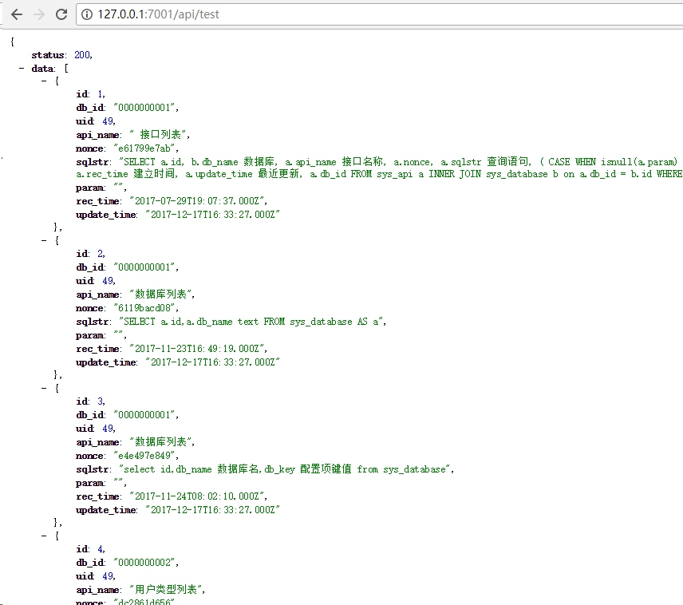
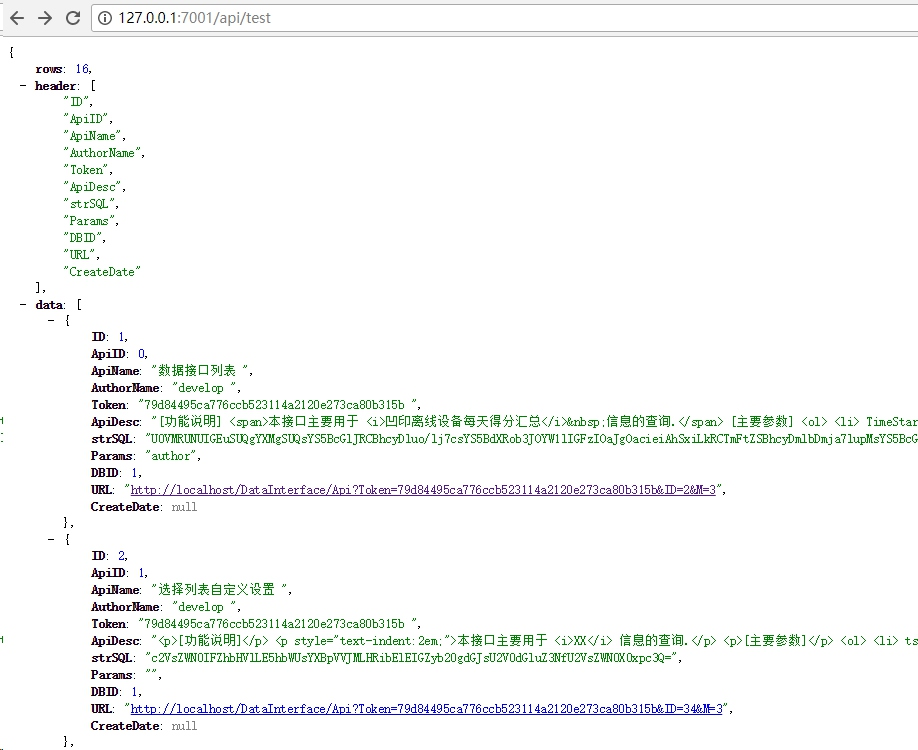

# Egg.js基础

>成钞公司印钞管理部 李宾


- - - - -
<!-- .slide: style="background-image:url('./img/osx.jpg');" -->


- - - - -
# 下载
[下载 8.9.4 LTS](https://nodejs.org/en/)     [文档](https://nodejs.org/api/documentation.html)
[中文版文档](http://nodejs.cn/api/)
> 下载完毕后安装即可使用。

```dos
node -v
V8.7.0
```
- - - - -
# NPM
> node.js中自带的包管理工具。

[官网](https://www.npmjs.com/)  [文档](https://docs.npmjs.com/getting-started/what-is-npm)
```dos
cd yourAppDir
e:\yourAppDir > npm install --save echarts
e:\yourAppDir > npm install --save-dev webpack
e:\yourAppDir > npm uninstall --save echarts
c:\ > npm install -g vue-cli
```
- - - - -
# cnpm
由于一些众所周知的原因，npm在国内安装软件包的时候非常慢，因而淘宝启动了一个叫cnpm的镜象，墙内也能很方便地使用了。其用法与cnpm一样，支持 npm 除了 publish 之外的所有命令。
```dos
c:\> npm install -g cnpm --registry=https://registry.npm.taobao.org
```
- - - - -
# 开发前的准备
点击下载[Visual Studio Code
](https://code.visualstudio.com/)
- - - - -
# nodejs 官网例子
建立文件app.js，写一个简单的http服务端:
```js
// app.js
const http = require('http');

const hostname = '127.0.0.1';
const port = 3000;

const server = http.createServer((req, res) => {
  res.statusCode = 200;
  res.setHeader('Content-Type', 'text/plain');
  res.end('Hello World\n');
});

server.listen(port, hostname, () => {
  console.log(`Server running at http://${hostname}:${port}/`);
});
```
启动服务
```dos
c:\> node app.js
```
- - - - -
# Egg.js

阿里在2016年南京JsConf 大会上正式开源的NodeJS框架，[当时的分享PPT在此](https://raw.githubusercontent.com/atian25/blog/master/assets/files/egg%20-%20JSConf%20China%202016.pdf)。在介绍Egg.js之前有必要简单了解一下Express和KOA

- - - - -
# Express
[express](http://www.expressjs.com.cn/starter/hello-world.html)是目前node.js上最流行的web应用框架，由于在node.js 7.6以后正式支持async异步调用，所以目前有部分开发者已经转移到KOA等框架。
```js
var express = require('express');
var app = express();

// 这里的function称为回调函数，callback function。
app.get('/', function (req, res) {
  res.send('Hello World!');
});

var server = app.listen(3000, function () {
  var host = server.address().address;
  var port = server.address().port;

  console.log('Example app listening at http://%s:%s', host, port);
});
```
> 回调函数可以简单理解为函数接收多个参数，其中最后一个参数是一个函数，里面包含了对传入数据的处理方式，这在js的编程中是一个较普遍的概念。


- - - - -
<p class="center" style="font: 150px 'Italiana', sans-serif;text-transform: lowercase;">Koa</p>
<p class="center" style="font-size:16px;">Koa -- 基于 Node.js 平台的下一代 web 开发框架</p>
- - - - -
# [简介](https://koa.bootcss.com/)
koa 是由 Express 原班人马打造的，致力于成为一个更小、更富有表现力、更健壮的 Web 框架。 使用 koa 编写 web 应用，通过组合不同的 generator，可以免除重复繁琐的回调函数嵌套， 并极大地提升错误处理的效率。koa 不在内核方法中绑定任何中间件， 它仅仅提供了一个轻量优雅的函数库，使得编写 Web 应用变得得心应手。
- - - - -
<h1 class="italiana">hello world</h1>
```js
const Koa = require('koa');
const app = new Koa();

app.use(async ctx => {
  ctx.body = 'Hello World';
});

app.listen(3000);
```
- - - - -
# Middleware
koa的洋葱圈模型:

- - - - -
```js
const Koa = require('koa');
const app = new Koa();

// x-response-time
app.use(async (ctx, next) => {
  const start = Date.now();
  await next();
  const ms = Date.now() - start;
  ctx.set('X-Response-Time', `${ms}ms`);
});

// logger
app.use(async (ctx, next) => {
  const start = Date.now();
  await next();
  const ms = Date.now() - start;
  console.log(`${ctx.method} ${ctx.url} - ${ms}`);
});

// response
app.use(async ctx => {
  ctx.body = 'Hello World';
});

app.listen(3000);
```
- - - - -
# app.context
app.context 是 ctx 的原型。
```js
const Koa = require('koa');
const app = new Koa();
// ...
app.context.db = db();

app.use(async ctx => {
  console.log(ctx.db);
});
```
- - - - -
# 快速初始化
```dos
$ npm i egg-init -g
$ egg-init egg-example --type=simple
$ cd egg-example
$ npm i
```
- - - - -
# 跟着教程一步步学习
添加控制器
```js
// ./app/controller/api.js
"use strict";

const Controller = require("egg").Controller;

class ApiController extends Controller {
    async index() {
        this.ctx.body = {
            status: 200,
            data: [{
                name: "zhangsan",
                age: 21
            }]
        };
    }
}

module.exports = ApiController;
```
```js
// ./app/router.js
"use strict";
module.exports = app => {
    const { router, controller } = app;
    router.get("/", controller.home.index);
    router.get("/api", controller.api.index);
};
```
[快速入门](https://eggjs.org/zh-cn/intro/quickstart.html)
- - - - -
# 连接mysql数据库
[egg-mysql](https://www.npmjs.com/package/egg-mysql)
```dos
$ npm i egg-mysql --save
```
在${app_root}/config/plugin.js启用插件:
```js
exports.mysql = {
  enable: true,
  package: 'egg-mysql',
};
```
- - - - -
在${app_root}/config/config.default.js添加mysql配置信息:
```js
config.mysql = {
        // database configuration
        client: {
            // host
            host: "localhost",
            // port
            port: "3306",
            // username
            user: "root",
            // password
            password: "root",
            // database
            database: "api"
        },
        // load into app, default is open
        app: true,
        // load into agent, default is close
        agent: false
    };
```
- - - - -
# query data
controller:
```js
async apiList() {
        const mysql = this.ctx.app.mysql;
        const data = await mysql.query("select * from sys_api");

        this.ctx.body = {
            status: 200,
            data
        };
    }
```
router:
```js
router.get("/api/list", controller.api.apiList);
```
拼接 sql 语句
> const results = await app.mysql.query('update posts set hits = (hits + ?) where id = ?', [1, postId]);
- - - - -
# 测试结果


- - - - -
# CRUD
遵循[官网说明](https://www.npmjs.com/package/egg-mysql)编写相应代码即可。
- - - - -
# 连接MS SQL
[node-mssql 文档](https://www.npmjs.com/package/mssql)
```js
// ./app/lib/mssql.config.js
const mssql = {
    user: "sa",
    password: "123",
    server: "localhost", // You can use 'localhost\\instance' to connect to named instance
    database: "api",
    options: {
        encrypt: false // Use this if you're on Windows Azure
    }
};

module.exports = mssql;
```
- - - - -
# 封装查询函数
```js
// ./app/lib/mssql.js
const config = require("./mssql.config");
const sql = require("mssql");

const query = async sqlStr => {
    const pool = await sql.connect(config);
    const result = await pool.request().query(sqlStr);
    await sql.close();
    return {
        rows: result.rowsAffected[0],
        header: result.recordset.length === 0 ? [] : Object.keys(result.recordset[0]),
        data: result.recordset
    };
};

module.exports = { query };
```
- - - - -
# 使用
```js
const mssql = require("../lib/mssql");
async apiMSSql() {
    const data = await mssql.query("select * from tblApi");
    this.ctx.body = data;
}
```
- - - - -
# 结果


- - - - -
# 改进
- 基于快速实现功能的目的将mssql的连接和查询封装为了独立的模块，此处可考虑将其封装为egg的插件，方便直接**注入 this.app 中**。
- 此处连接数据库-->查询-->关闭数据库，可考虑合理使用连接池，**将连接态全局保存**;
- 封装更多的功能

- - - - -
# oracle
[文档](https://www.npmjs.com/package/oracledb)
后续的数据库连接操作自行根据官网文档编写业务代码。
- - - - -
# Q&A