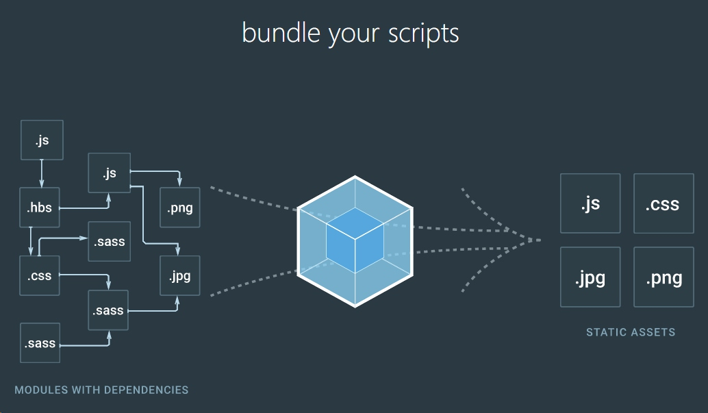

# JS的模块化发展
- - - - -
# 最初我们如何写代码
```html
<body>
    <button onclick="foo">这是按钮</button>
    <script>
    function foo() {
        // js逻辑和html混淆，维护时要同时处理html和js两部分，这时需要解耦(decouple)
    }
    </script>
</body>
```
- - - - -
# js和html的分离
```js
    $('button').on('click', function() {
        foo();
    })
    
    foo() {
        // 事件a,可以被恶意篡改
    }
    
    bar() {
        // 事件b
    }
    
    // 变量污染
    foo = 'some other variable';
```
> 当系统足够大以后，变量间容易被污染，引起命名冲突。

- - - - -
# NampSpace 命名空间
```js
    var app = {
		foo:function(){
			// foo
		},
		bar:function(){
			// bar
		}
	};
	app.foo();
```
> 这样可大幅减少global变量的数量，但其本质仍是变量。

- - - - -
# 匿名闭包函数：IIFE模式
Immediately Invoked Function Expression(立即执行函数表达式)
```js
var app = (function() {
    var _privateVariable = '';
    var foo = function() {

    };
    return {
        foo: foo
    }
})();
app.foo();
app._privateVariable; // 对它的引用会报错                             
```

延伸阅读：[IIFE](https://developer.mozilla.org/en-US/docs/Glossary/IIFE)
- - - - -
# 依赖的引入
```js
var app = (function($) {
    var _btnDom = $('button');
    console.log(_btnDom);

    var foo = function() {

    };
    return {
        foo: foo
    }
})(jQuery);
app.foo();
```
> 此时已有了现代模块的雏形，但问题还未完全解决。

- - - - -
# 文件的加载依赖
```html

<script src="../../assets/global/plugins/jquery.min.js"></script>
<script src="../../assets/global/plugins/require.min.js"></script>
<script src="../../assets/global/plugins/jquery.base64.min.js"></script>
<script src="../../assets/global/plugins/jquery-migrate.min.js"></script>

<script src="../../assets/global/plugins/bootstrap/js/bootstrap.min.js"></script>
<script src="../../assets/global/plugins/bootstrap-hover-dropdown/bootstrap-hover-dropdown.min.js"></script>
<script src="../../assets/global/plugins/jquery-slimscroll/jquery.slimscroll.min.js"></script>
<script src="../../assets/global/plugins/jquery.blockui.min.js"></script>
<script src="../../assets/global/plugins/js.cookie.min.js"></script>
<script src="../../assets/global/plugins/uniform/jquery.uniform.min.js"></script>
<script src="../../assets/global/plugins/bootstrap-switch/js/bootstrap-switch.min.js"></script>
<script src="../../assets/global/plugins/moment.min.js"></script>
<!-- END CORE PLUGINS -->
<!-- BEGIN PAGE LEVEL PLUGINS -->
<script src="../../assets/global/plugins/bootstrap-daterangepicker/daterangepicker.min.js"></script>
<!-- IMPORTANT! fullcalendar depends on jquery-ui-1.10.3.custom.min.js for drag & drop support -->
<!-- END PAGE LEVEL PLUGINS -->
<!-- BEGIN PAGE LEVEL SCRIPTS -->
<script src="../../assets/global/scripts/app.min.js"></script>
<script src="../../assets/layouts/layout/scripts/layout.min.js"></script>
<script src="../../assets/layouts/global/scripts/quick-sidebar.min.js"></script>
<script src="../../assets/layouts/layout/scripts/demo.min.js"></script>
<!-- END PAGE LEVEL SCRIPTS -->
<!-- BEGIN PAGE LEVEL PLUGINS -->

<script src="../../assets/global/plugins/bootstrap-confirmation/bootstrap-confirmation.min.js"></script>

<script src="../../assets/global/plugins/select2/js/select2.full.min.js"></script>

<script src="../../assets/global/plugins/datatables/media/js/jquery.dataTables.min.js"></script>
<script src="../../assets/global/plugins/datatables/media/js/jszip.min.js"></script>
<script src="../../assets/global/plugins/datatables/media/js/pdfmake.min.js"></script>
<script src="../../assets/global/plugins/datatables/media/js/vfs_fonts.js"></script>

<script src="../../assets/global/plugins/datatables/extensions/ColReorder/js/dataTables.colReorder.min.js"></script>
<script src="../../assets/global/plugins/datatables/extensions/Scroller/js/dataTables.scroller.min.js"></script>
<script src="../../assets/global/plugins/datatables/extensions/FixedHeader/js/dataTables.fixedheader.min.js"></script>
<script src="../../assets/global/plugins/datatables/extensions/Buttons/js/dataTables.buttons.js"></script>
<script src="../../assets/global/plugins/datatables/extensions/Buttons/js/buttons.html5.js"></script>
<script src="../../assets/global/plugins/datatables/extensions/Buttons/js/buttons.print.js"></script>
<script src="../../assets/global/plugins/datatables/extensions/Buttons/js/buttons.share.js"></script>
<script src="../../assets/global/plugins/datatables/extensions/Buttons/js/buttons.colVis.js"></script>
<script src="../../assets/global/plugins/datatables/extensions/FixedColumns/js/dataTables.fixedColumns.min.js"></script>
<script src="../../assets/global/plugins/datatables/plugins/bootstrap/dataTables.bootstrap.js"></script>
<script src="../../assets/global/plugins/datatables/plugins/searchHighlight/dataTables.searchHighlight.min.js"></script>
<script src="../../assets/global/plugins/datatables/plugins/searchHighlight/jquery.highlight.js"></script>
<!-- END PAGE LEVEL PLUGINS -->

<!-- BEGIN PAGE LEVEL SCRIPTS -->
<script src="../../assets/global/plugins/jquery-idle-timeout/jquery.idletimeout.js"></script>
<script src="../../assets/global/plugins/jquery-idle-timeout/jquery.idletimer.js"></script>
<script src="../../assets/pages/controller/idletimeout.min.js"></script>
<!-- END PAGE LEVEL SCRIPTS -->
<!--BEGIN MY LEVEL SCRIPT-->
<script src="../../assets/global/plugins/bootstrap-toastr/toastr.min.js"></script>
<script src="../../assets/global/plugins/clipboard/clipboard.min.js"></script>
<script src="../../assets/pages/controller/CommonFunctions.min.js"></script>
<script src="../../assets/pages/controller/QualityTable.min.js"></script>
```
- - - - -
    * js从上向下执行，需要注意script引入的顺序，例如jQuery需要在插件之前先引入。
    * 大量的网络并发请求。

> 需要按需加载。
- - - - -
# CommonJS规范
最初出现在Node.js中，将javascript运行在服务端。
```js
    // math.js
    var add = function(a, b) {
        return a + b;
    }
    module.exports = add;
    
    // app.js
    var math = require('math.js');
    math.add(2, 3) == 5;
```
> 浏览器端没有module,export,require，只能在服务端使用。

扩展阅读：[js模块化编程之彻底弄懂CommonJS和AMD/CMD！](https://www.cnblogs.com/chenguangliang/p/5856701.html)
- - - - -
# [RequireJS](http://requirejs.org/)
AMD(Async Module Definition),**异步**模块加载
```html
<script src="js/require.js" data-main="js/main"></script>
```
```js
// chartTool.js
define([
    '../plugins/echarts/js/extension/dataTool.min',
    '../plugins/echarts/js/extension/ecStat.min',
    '../plugins/echarts/js/extension/statisticsTool.min',
    '../plugins/echarts/js/extension/echarts-wordcloud.min'
  ],
  function(dataTool, ecStat, statTool) {
    var getOption = function(objRequest, echarts) {
      var option = {};
      // foo();
      return option;
    }
    return {
      getOption: getOption
    };
  });
```
```js
//main.js
var util = require('chartTool');
util.getOption(request,echarts);
```
- - - - -
>requireJS的加载方式是异步执行的，即依赖的文件载入后才执行后续的动作。从2014年开始，AMD的加载模式逐步被webpack同步加载所取代，在此期间还有阿里巴巴seaJS的cmd(Common Module Definition)方案以及browserify等，目前均已被webpack打包淘汰。
- - - - -
# webpack
[webpack的文档可以看这里](https://doc.webpack-china.org/concepts/)，它通过资源分析、热加载、资源转换等自动打包为所需要的发布版本，是目前的主流方案。

> webpack的文件打包配置较为复杂，需要至少2个工作日以上的学习和练习。在资源打包的环节还有gulp这样的技术方案，目前已被淘汰，此处不再展开。

- - - - -
# [parcel.js](https://parceljs.org/) 打包
```html
<html>
<body>
  <script src="./index.js"></script>
</body>
</html>
```
```js
// index.js
import main from './main';
main();
```
```js
// main.js
import classes from './main.css';
export default () => {
  console.log(classes.main);
};
```
```css
/* main.css */
.main {
  background: url('./images/background.png');
  color: red;
}
```
```cmd
 > parcel index.html 
```
- - - - -
# ES6 Module
```
// math.js
export default {
    add:(a,b)=>a+b
}

// main.js
import math from 'math';
math.add(2,3) == 5;
```
延伸阅读：[ES6的Module语法](http://es6.ruanyifeng.com/#docs/module)
- - - - -
# ES6 Module
```
// math.js
export {
    add:(a,b)=>a+b
}

// main.js
import {add} from 'math';
add(2,3) == 5;
```
> ES6的模块导出不加 **default** 时，导入需要指定函数名，同时二者要保持一致。

- - - - -
# ES6 Class
```js
// excel.js
export default class Excel {
    constructor(config) {
        let filename = document.title;
        if (Reflect.has(config, "filename")) {
            filename = config.filename;
        }
        config.filename = filename + ".xlsx";
        this.config = config;
    }
    save(){
        // save excel代码逻辑
    }
}

// app.js
import excel from './.excel';
let config = {
    filename:'文件名',
    // 其它配置信息
}

let excel = new Excel(config);
excel.save();
```
> constructor方法是类的默认方法，通过new命令生成对象实例时，自动调用该方法。
> 类必须使用new调用，否则会报错。

- - - - -
# 类的公有方法和私有方法
```js
// excel.js
export default class Excel {
    constructor(config) {
        this.config = config;
    }
    
    _convertData(){
        // ...
    }
    save(){
        let data = this._convertData();
                
        // save excel代码逻辑
    }
}

// app.js
import excel from './.excel';
let config = {};
let excel = new Excel(config);
excel.save();
```
- - - - -
# 类的继承
```js
// excel.js
export default class MyExcel extends Excel {
    constructor(exConfig) {
        super(config); // 调用Excel的constructor函数，传入config
        this.exConfig = exConfig;
    }
    foo(){
        // 此处扩展一些其它功能
    }
}
```
- - - - -
# [Babel](http://babeljs.io/) 转码
> 在ES6尚未普及时，为保证浏览器的兼容性，还需要babel将ES6的代码转码翻译成ES5。在Babel官网有一个关于[ES6特性的介绍链接](http://babeljs.io/learn-es2015/#ecmascript-2015-features)，同时[这里](http://es6.ruanyifeng.com/)也有一份较详细的中文版教程。

- - - - -
# 目前社区的技术选型
> 社区目前使用ES6 Class与Module作模块化输出，Babel转码ES5，由webpack打包。

