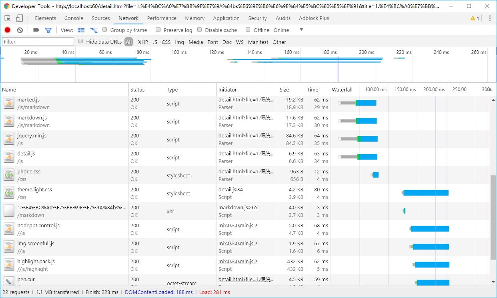
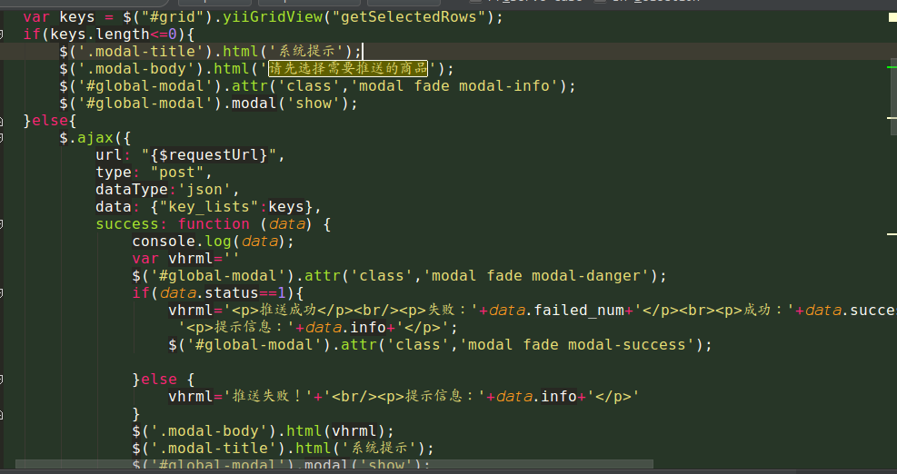
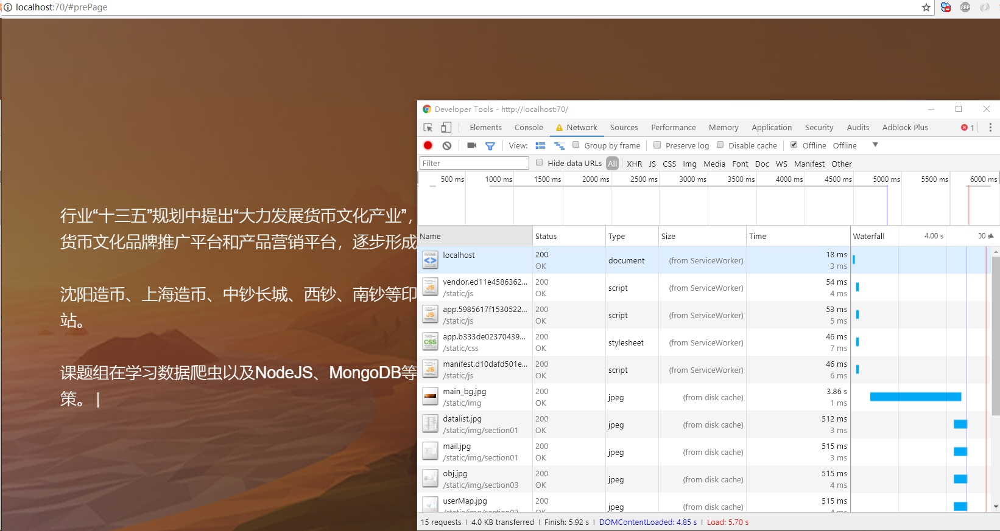

#b/s架构开发的发展历程
- - - - -
##自我介绍
李宾，07年北京印刷学院印刷工程专业，07年进入成钞公司，12年四川大学软件工程在职研究生，13年6月进入技术质量部。
<i class="fa fa-github"></i>[www.github.com/realeve]( www.github.com/realeve)
<i class="fa fa-weixin"></i>41192163

- - - - -
> 质量信息管理系统代码片断，2014年，**asp**，第一次涉足B/S架构开发。

```html
<table  style="width:720px;margin-left:24px;table-layout:fixed;align:center;cellpadding:3;cellspacing:0;">
	<tbody>
		 <%
		 strMachineTemp=""
		 nColor=2
		 Do Until rsg.Eof	
			if strMachineTemp <> rsg("机台") then
				nColor=nColor+1	
			end if
			if nColor mod 2 =1 then
				HColor="#F4F4F4"
			else
				HColor="#FFFFFF"
			end if%>
			<tr>
				<td class="FirstRow" bgcolor="<%=HColor%>"> <%=rsg("品种")%></td>
				<td bgcolor="<%=HColor%>"> <%=rsg("正反面")%></td>
				<td bgcolor="<%=HColor%>"> <%=rsg("机长")%></td>
				<td bgcolor="<%=HColor%>"> <%=rsg("总张数_技质")%></td>
				<td bgcolor="<%=HColor%>"> <%=rsg("平均得分_技质")%></td>				
				<td bgcolor="<%=HColor%>"> <%=rsg("总张数_质检员")%></td>
				<td bgcolor="<%=HColor%>"> <%=rsg("总张数_机台")%></td>
				<td class="LastRow"  bgcolor="<%=HColor%>">
    				 <%if rsg("标准偏差_机台")<1 then%>0<%end if%>
    				 <%=rsg("标准偏差_机台")%>
				 </td>
			</tr>					
		<%
		strMachineTemp=rsg("机台")
		rsg.MoveNext
		Loop%>
	</tbody>
</table>
```

- - - - -
#常见问题 —— 一锅粥
1.模块化程度低
菜单：页面间菜单的复用
报表：所有报表需要手动定义thead,tbody

2.逻辑与页面视图高度耦合，后期维护困难
3.样式直接写在html中，未使用css管理样式
4.部分页面使用table定位布局，对于当时已兴起的html5技术尚未涉及
>在过去10年，以asp**快速实现功能**的开发模式成为了许多初学者的首选，在后续的深入开发中可能都会遇到这样的一些问题，此时具代表性的开发软件主要是dreamware.

- - - - -
> “PHP是世界上最好的语言”

```php
<!DOCTYPE html>
<html lang="en">
<head>
    <meta charset="UTF-8">
    <meta name="viewport" content="width=device-width, initial-scale=1.0">
    <meta http-equiv="X-UA-Compatible" content="ie=edge">
    <title>Document</title>
    <!-- css 文件引用 -->
    <?php include "templates/style.php";?>
</head>
<body>
    <!-- 头部 -->
    <?php include "templates/header.php";?>

    <!-- 侧边菜单 -->
    <?php include "templates/sidebar_menu.php";?>

    <!-- 页面主体 -->
    <?php include "templates/content.php";?>

    <!-- 底部，同时包含必要的js文件 -->
    <?php include "templates/footer.php";?>
</body>
</html>
```
- - - - -
#PHP
>2016年开始重构成钞公司质量信息平台，以php为服务端，解决了模块化的问题。

目前PHP是应用最为广泛的服务端语言，因为简单易学成为了许多开发者的首选语言。在应用较广的PHP框架中主要有ThinkPHP(对国内主流虚拟云主机支持较好：阿里云，新浪云)、CodeIgniter(轻量、简单)、Larvel(社区目前发展最活跃)等。

在用php开发的过程中，逐渐对mvc/mvp有了学习和认识，更多技术细节推荐阅读这篇文章：[MVC，MVP 和 MVVM 的图示](http://www.ruanyifeng.com/blog/2015/02/mvcmvp_mvvm.html)

- - - - -
#Server Side Rendering 服务端渲染(SSR)
>不管是用asp/php/java作为服务端，我们把这种**通过服务器直接生成html文本**输出至浏览器的方案统称为服务端渲染。其最大的特点是查看网页源码时能看到页面所有的dom元素的html文本。

在印制行业中有许多应用的功能是以数据或报表为主，点击**查询**按钮后，整个系统将经历以下过程：
1. 浏览器端/客户端/前端发起查询请求，http Request;
2. 服务端根据前端请求，连接数据库，发起SQL请求并等待数据库返回结果；
3. 服务端对返回的数据拼凑 Table 的 HTML 文本返回前台;
4. 前台读取html内容，并请求css/js/font/img等资源，同时将结果渲染。
- - - - -
# 网页渲染过程中的网络请求

- - - - -
# 系统为什么这么慢？
同样以行业中的各类报表系统为例，要保证系统运行速度，需要在以下几个方面做优化：
1. 数据库优化，部分系统甚至未建议表单索引（钞纸机检系统本地数据存储）；
2. 服务端缓存，几乎都没做；
3. 减少资源请求频次，但SSR中的每一次请求都需要重新重新请求资源；
4. 浏览器渲染时间的消耗。比如8000行数据的报表，如何快速渲染(采用数据分页分增加数据请求次数)；
- - - - -
# 前端渲染
为了减少页面渲染中(前后台)的不必要时间消耗，前端渲染的方案开始应用，这也得益于[ ajax ](https://developer.mozilla.org/en-US/docs/Web/Guide/AJAX)的出现。
> ajax实现了在页面**不刷新**的情况下前台页面同后端获取数据的能力。

延伸阅读：[JSON](https://developer.mozilla.org/en-US/docs/Web/JavaScript/Reference/Global_Objects/JSON) 、[ ajax ](https://developer.mozilla.org/en-US/docs/Web/Guide/AJAX)
- - - - -
# 页面局部刷新
```js
$.ajax({
    url: './yourAPI',
    type: 'GET',
    dataType: 'json'
  })
  .done(function(data) {
    var tbodyStr = data.map(tdData => {
      var tdStr = tdData.map(item => `<td>${item}</td>`).join('');
      return `<tr>${tdStr}</tr>`;
    }).join('');
    $('#yourTable tbody').html(tbodyStr);
  });
```
jQuery的出现为开发者解决了页面兼容性的问题，在用户交互事件中，系统从后台获取数据并实现**页面局部刷新**，极大提升了用户体验。
此时后端在以往的基础上还需要提供**API数据接口**功能。
- - - - -
# 前后端分离
虽然页面局部刷新为用户的使用体验提供了一大步，但开发者的体验却未得到明显的改善，这里仅是将后端的一些职责转移到了前端，开发者需要同时维护前后两端的代码。

此后出现了后端只负责数据接口，前端负责页面样式、逻辑、数据请求等所有工作，这也让开发效率和后期的维护效率得到了改善。
- - - - -
# 前端页面的渲染——字符串模板
```js
    var html = '<p>你所想渲染的html内容</p>';
    $('#container').html(html);
```
前面通过拼凑字符串的方式又让前端又遇到了最初asp年代同样的问题——**html片断和js代码混合编排**。

问题的解决同后端解决一样，引入字符串模板。

延伸阅读：[常见的字符串模板速度测试](http://ecomfe.github.io/etpl/performance/render-time.html)、[ 百度eTpl](http://ecomfe.github.io/etpl/feature.html#performance)
- - - - -
# 字符串模板
```html
<!-- target: table -->
    <table class="table table-hover table-light">
        <thead>
            <!-- import: thead -->
        </thead>
        <tbody>
          <!-- import: tbody -->
        </tbody>
    </table>
    
<!-- target: thead -->
    <tr class="uppercase">
        <th>序号</th>
        <!-- for: ${header} as ${head} -->
            <th>${head.title}</th>
        <!-- /for -->
    </tr>
    
<!-- target: tbody -->
    <!-- if: ${rows} == 0 -->
    <!-- var: colspan = ${cols}+1 -->
        <tr><td colspan=${colspan} class="text-center">未检索到 ${title} 相关数据</td></tr>
    <!-- /if -->
    <!-- for: ${data} as ${item},${index} -->
        <!-- var:idx = ${index}+1 -->
        <tr>
            <td> ${idx} </td>
            <!-- for: ${item} as ${td} -->
            <td>${td}</td>
            <!-- /for -->
        </tr>
    <!-- /for -->
```
- - - - -

- - - - -
# 前端三大流行框架的产生
>技术的进步是为了~~更好的kpi~~解决现有的问题。

*问题1：对性能的极致追求。*
在字符串模板/字符串拼接的过程中，两次数据请求结果只有部分数据修改时，以前的处理方式是更新dom结点的所有数据，页面需要重新计算并渲染。
延伸阅读：[react的dom diff算法](https://segmentfault.com/a/1190000000606216) 、[如何理解虚拟DOM(visual dom)](https://www.zhihu.com/question/29504639)
- - - - -
# 前端三大流行框架的产生
*问题2：数据驱动视图*
```html
    <p>数据录入测试：</p>
    <p id="result"></p>
    <input type="text" id="text">
```
```js
   $('#text').on('keyup', function() {
        $('#result').html($(this).val());
    });
```
> 在传统的开发中，我们需要绑定input按钮的事件。

- - - - -
# Vue.js
```html
    <div id="app">
        <p>{{message}}</p>
        <input type="text" v-model="message">
    </div>
```
```js
    var app = new Vue({
        el: '#app',
        data: {
            message: 'hello'
        }
    })
```
延伸阅读：[Vue.js官方文档](https://cn.vuejs.org/v2/guide/)
> 在 Vue.js 中不需要用户绑定事件，当数据变化时，视图将同步变化，这种数据驱动（data driven）的模式将开发效率和页面运行效率提高到了极致。同Vue.js 一起的框架还有 Facebook 的 react 以及 google 的 angular.js。

- - - - -
# SPA
前面讲到每次页面刷新时，系统将重新加载所有信息，但在html中有一个叫锚点的技术，可以实现页面**在不刷新的情况下加载路由**。

伴随着Vue.js等的发展，出现了**SPA**（single page application,单页应用程序)技术，它的标志就是整个系统仅有index.html一个页面，所有请求均在其中完成，这样对于资源请求的优化已经做到了极致。

关于SPA及PWA(渐进式应用开发)等技术的细节，此处暂时不展开说明，接下来我们来讲述关于搜索引擎优化（SEO，Search Engine Optimization）的一些问题。
延伸阅读：[前端：将网站打造成单页面应用SPA（一）](https://segmentfault.com/a/1190000002920768)
- - - - -
# PWA(Progressive Web Apps) 演示
[什么值得卖](http://localhost:70/#prePage) 在网络控制面板中开启offline的情况下，仍然能加载数据，但[另一个网站](http://localhost:60)却不能


- - - - -
#SEO
> 随着前后端分离的发展，前端页面的可见源码变得越来越少，以下是成钞信息网(包含前后台管理)在查看网页源码时html部分的内容。

```html

<body>
    <div id="app">数据加载中...</div>
    <!-- Todo: only include in production -->
    <script>// This service worker file is effectively a 'no-op' that will reset any
// previous service worker registered for the same host:port combination.
// In the production build, this file is replaced with an actual service worker
// file that will precache your site's local assets.
// See https://github.com/facebookincubator/create-react-app/issues/2272#issuecomment-302832432

self.addEventListener('install', () => self.skipWaiting());

self.addEventListener('activate', () => {
  self.clients.matchAll({ type: 'window' }).then(windowClients => {
    for (let windowClient of windowClients) {
      // Force open pages to refresh, so that they have a chance to load the
      // fresh navigation response from the local dev server.
      windowClient.navigate(windowClient.url);
    }
  });
});</script>
        <!-- built files will be auto injected -->
<script type="text/javascript" src="/app.js"></script></body>
```
>对于搜索引擎爬虫来讲，无法读取页面的内容，这对于一些新闻网站来讲是不可接受的。

- - - - -
# 重新回到SSR
为了解决SEO的问题，react/vue.js等提出了用node.js做SSR渲染的方案，通过对原来前端代码的简单改造实现node.js的服务端渲染。

对于google,bing等搜索引擎，目前已支持SPA单页应用的爬虫抓取，百度也在计划中。
- - - - -
# Q&A