# 如何不间断部署前端代码
- - - - -
> 本章问题:你负责了一项线上问卷调查，其功能包含了问卷、投票、设置等。由于活动参与人数众多(上百万)，如果中途有部分功能调整，如何保证代码在部署的过程中不影响所有人的使用？
- - - - -
# 背景:Web浏览器的缓存策略
- - - - -
<!-- .slide: style="background-image:url('./img/osx.jpg');" -->
# http 状态码
- 5XX 服务器内部错误
- 4XX 客户端错误
- 3xx 重定向
- 2xx 成功

延伸阅读:[Node.js关于http status code的源码定义](https://github.com/nodejs/node/blob/master/lib/_http_server.js)

- - - - -
# 对状态码的正确使用
```
{
  201: 'Created', //数据写入成功
  206: 'Partial Content',// 跨域的options请求
  401: 'Unauthorized',// 登录无效或token验证失败
  403: 'Forbidden',// 用户无该路由的访问权限
  405: 'Method Not Allowed', // 接口的请求方法不当
}
```
- - - - -
# chrome debug network面板
资源不存在时返回404，否则返回200或304。
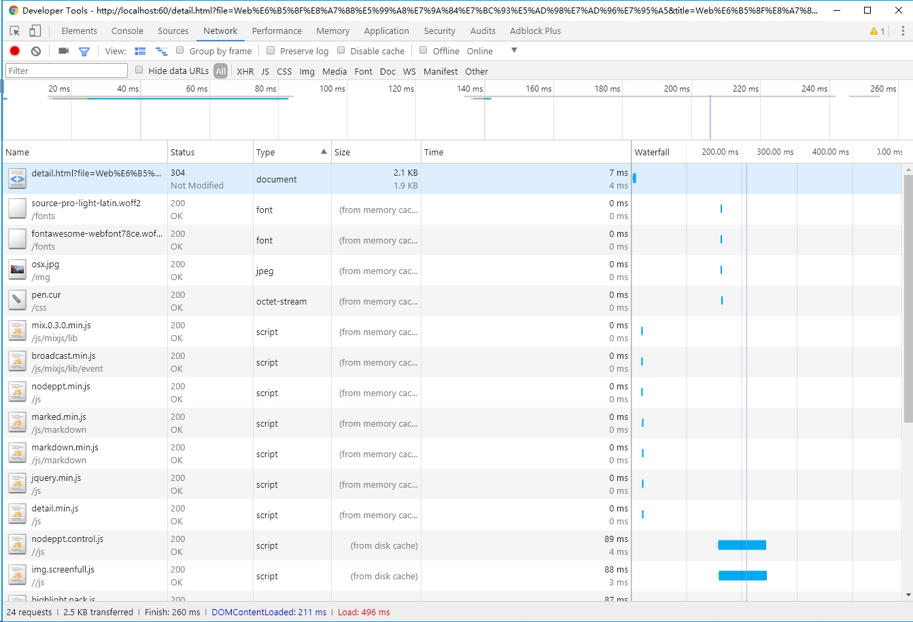

- - - - -
# 服务端成功返回数据
- **200 ok**:从服务器直接访问并返回资源，在首次加载资源或者关闭缓存后将返回该状态码。

- **200 from memory cache**:不访问服务器，直接读缓存，从内存中读取缓存。此时的数据时缓存到内存中的，当浏览器关闭以后，数据将不存在。

- **200 from disk cache**:不访问服务器，直接读缓存，从磁盘中读取缓存，当浏览器关闭以后，数据还是存在。

- **304 Not Modified**:访问服务器，发现数据没有更新，服务器返回此状态码，然后从缓存中读取数据。

延伸阅读:[由memoryCache和diskCache产生的浏览器缓存机制的思考](https://segmentfault.com/a/1190000011286027)

- - - - -
# 缓存管理,304的产生
> 由于304需要向服务器发起一次请求，所以需要将304 Not Modified 优化为200 from disk/memory cache。关键点为:cache-control,ETag,Expires三项

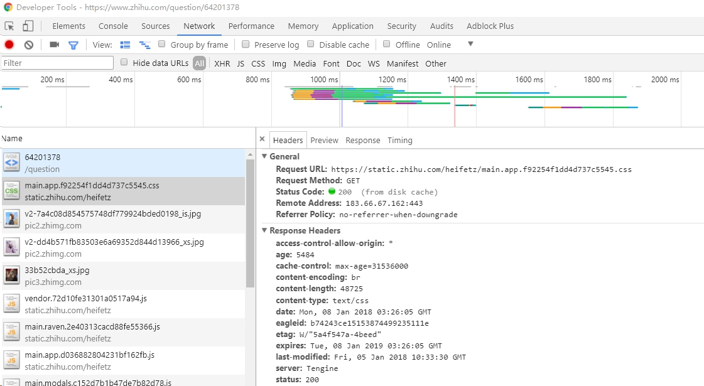
- - - - -
# 二、如何不间断部署前端代码
- - - - -
# 从一个简单的html页面说起

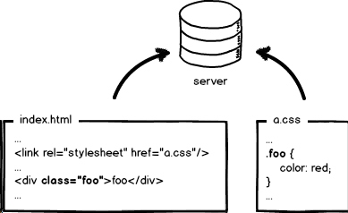
- - - - -
> 首次加载后的网络瀑布图，资源获取成功:status 200

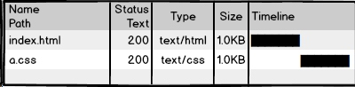
- - - - -
> 再次刷新页面后，资源被缓存:status 304，采用协商缓存

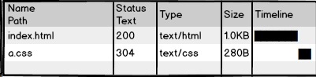
- - - - -
> cache-control优化之后，status 200,from disk cache.

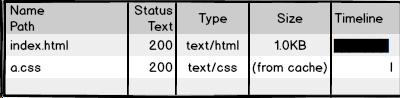
- cache-control 在文件名更新之前不会更新缓存
- - - - -
# 此时如何更新缓存？
> 通过更新页面中引用的资源路径，让浏览器主动放弃缓存，加载新资源，下次上线，把链接地址改成新的版本。

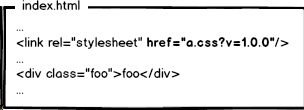
- 另一种在前端强制放弃缓存的策略是在资源链接的查询参数中加入随机数

- - - - -
## 现实中的线上项目往往会有多个资源引用
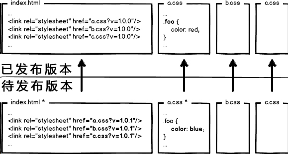
> 此时用version版本号查询的方式，在更新a的时候，可能会让b和c放弃缓存，问题的解决是需要让url的修改与文件内容关联。当时gulp-rev在打包的时候便是采用的此种方案。

- - - - -
# 引入文件指纹，MD5
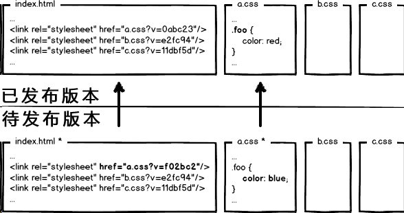
>  利用数据摘要算法，对文件求摘要信息，摘要信息与文件内容一一对应，就有了一种可以精确到单个文件粒度的缓存控制依据。

延伸阅读:[gulp-rev](https://www.npmjs.com/package/gulp-rev)
- - - - -
# 新的问题
> 现代互联网企业，为了进一步提升网站性能，会把静态资源和动态网页分集群部署，静态资源会被部署到CDN节点上，网页中引用的资源也会变成对应的部署路径。

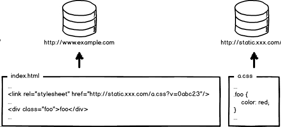
<br>
- 主站:www.cdyc.cbpm
- API:api.cdyc.cbpm
- CDN:cdn.cdyc.cbpm
- - - - -
当需要更新静态资源的时候，同时也会更新html中的引用
<br>
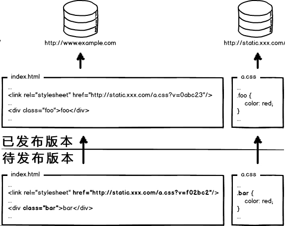
> 由于html与css均有更新，此时先部署页面还是先部署静态资源？

- - - - -
- **先部署页面，再部署资源**：在二者部署的时间间隔内，如果有用户访问页面，就会*在新的页面结构中加载旧的资源,用户将访问一个样式错乱的页面*。
- **先部署资源，再部署页面**：在部署时间间隔之内，有旧版本资源本地缓存的用户访问网站，浏览器将直接使用本地缓存，页面展现正常；但没有本地缓存或者缓存过期的用户访问网站，就会出现*旧版本页面加载新版本资源*的情况，导致页面执行错误。

> 对于访问量不大的项目，可以在访问人数较少的半夜或者假期上线，先上静态资源，再部署页面，这也是行业/成钞目前的实施方式。

- - - - -
# 没有访问人数较少的时候
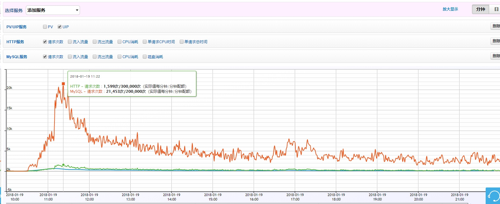
- - - - -
# 从覆盖式发布到非覆盖式发布
> 用文件的摘要信息来对资源文件进行重命名，把摘要信息放到资源文件发布路径中，内容有修改的资源就变成了一个新的文件发布到线上，不会覆盖已有的资源文件。

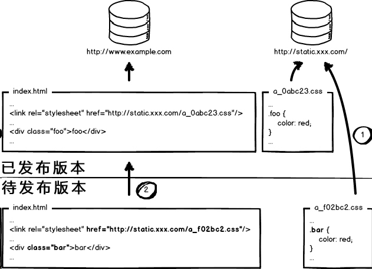

- - - - -

# 静态资源优化方案的总目标

* 配置超长时间的本地缓存(**cache**) —— 节省带宽，提高性能
* 采用内容摘要作为缓存更新依据(**md5**) —— 精确的缓存控制
* 静态资源CDN部署(**static.xxx.com**) —— 优化网络请求
* 更资源发布路径实现非覆盖式发布(**filename.md5.extName**) —— 平滑升级

- - - - -

## 所有静态资源加载的位置都要做这样的处理 

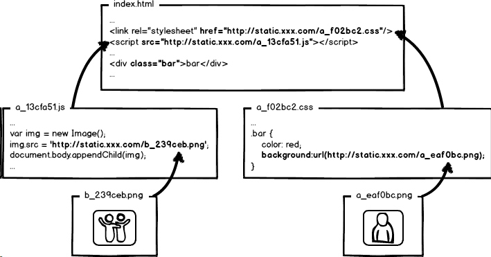
> 此时应该怎样部署页面？

- - - - -
#Q&A