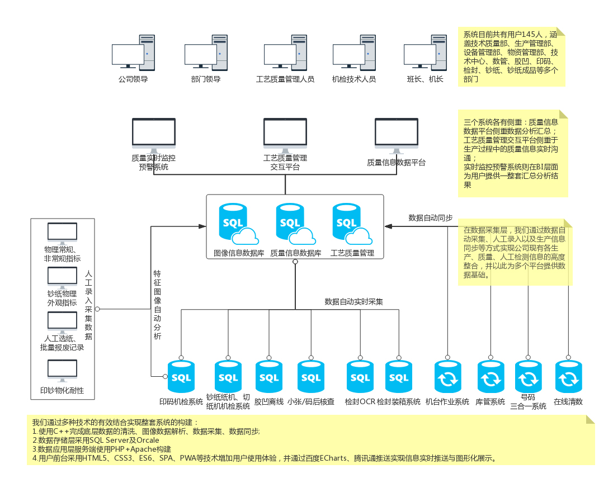
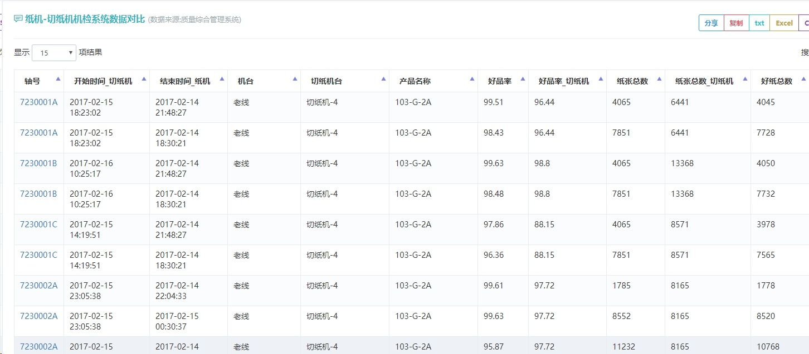
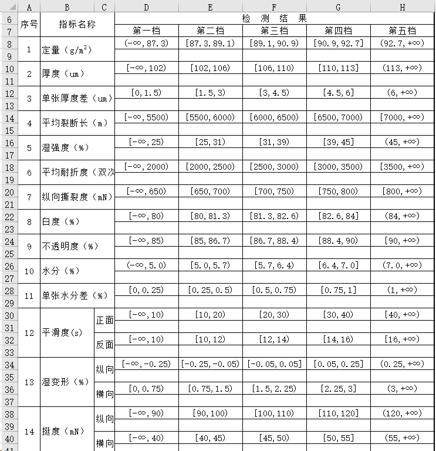
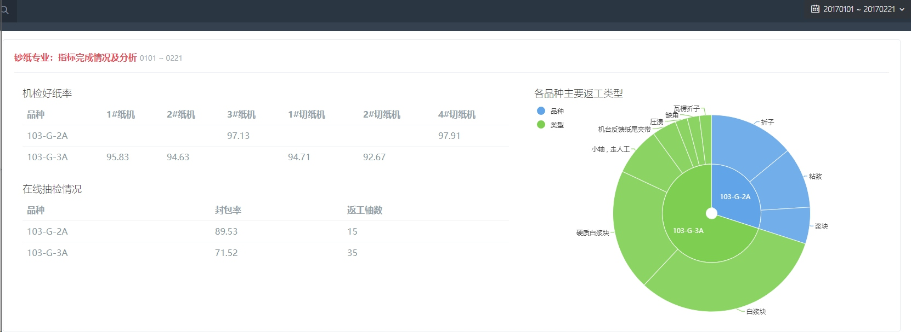
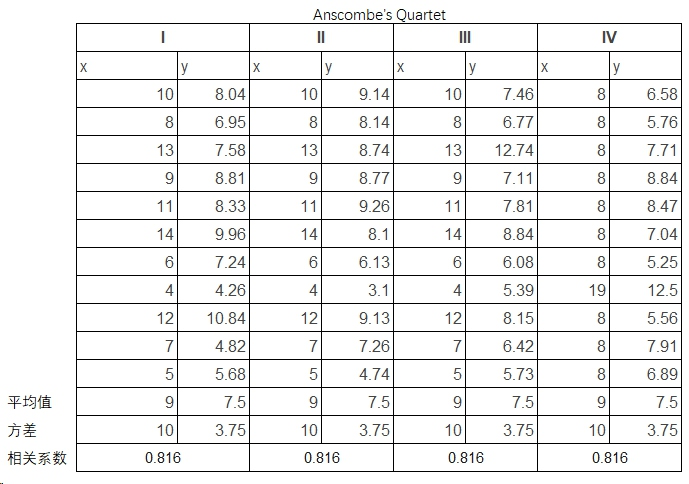
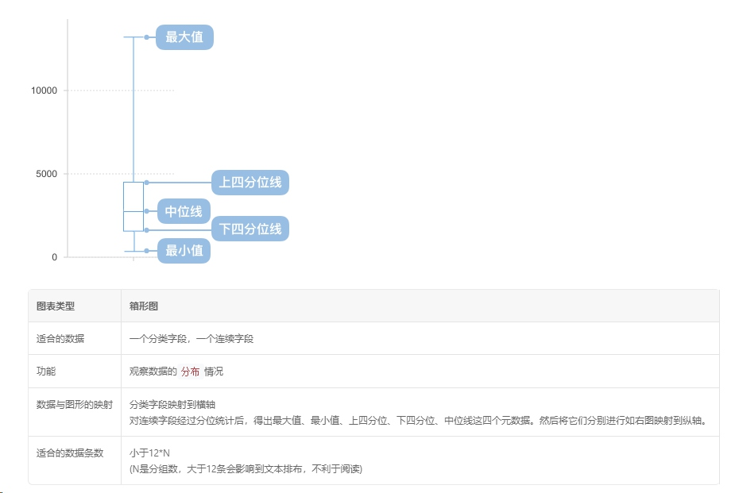
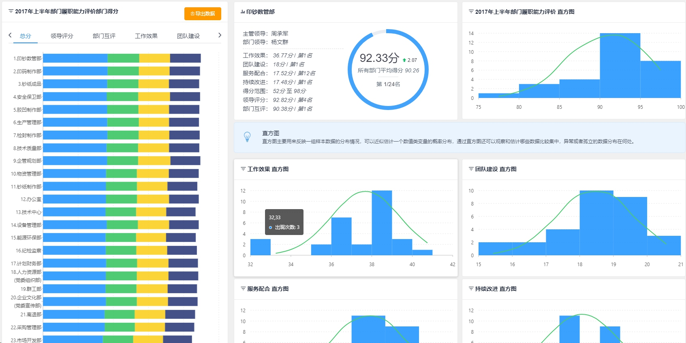

# 质量信息采集与应用
- - - - -
# 对相关技术的学习与积累
2013年6月加入技质部从事机检工作；
2014年1月起开始相关学习和印刷工序技术开发工作(C++,ASP)；
2015年完成信息应用方案设计，同年学习数据可视化及相关知识储备及基础信息采集(jQuery,Bootstrap,PHP)；
2016年完成整个系统，[同年5月在沈币行业统计会议上做过相关分享](http://localhost/topic/shenyang/)(ECharts,PHP,jQuery,Vue,Bootstrap)；
2017年补充完善及对整体的全新规划(ES6,Vue.js+Vue-Router+VueX,NodeJS等)；
- - - - -
1. 加入机检工作之后，繁琐的手工数据统计工作，希望寻求自动化的方式处理。
> 重复的手工劳动
> 问题的分析基于一定规则
> 数字化的信息，具有自动化采集的先决条件。

2. 自我提升的需要，不希望受制于对外协的依赖。
3. 对新的业务技能、专业知识的学习和应用。
- - - - -
[附件1：数据应用方案](http://localhost:60/markdown/plan/%E9%99%84%E4%BB%B61%EF%BC%9A%E8%B4%A8%E9%87%8F%E6%8E%A7%E5%88%B6%E4%B8%AD%E5%BF%83%E5%BA%94%E7%94%A8%E6%96%B9%E6%A1%88%E8%AE%BE%E8%AE%A1.svg)

[附件2：数据采集情况](http://localhost:60/markdown/plan/%E9%99%84%E4%BB%B62%EF%BC%9A%E8%B4%A8%E9%87%8F%E6%8E%A7%E5%88%B6%E4%B8%AD%E5%BF%83%E6%95%B0%E6%8D%AE%E9%87%87%E9%9B%86%E7%8E%B0%E7%8A%B6.svg)

[附件3：全流程信息追溯](http://localhost:60/markdown/plan/%E8%B4%A8%E9%87%8F%E4%BF%A1%E6%81%AF%E8%BF%BD%E6%BA%AF.svg)

[附件4：系统功能设计](http://localhost:60/markdown/plan/%E8%B4%A8%E9%87%8F%E4%BF%A1%E6%81%AF%E7%AE%A1%E7%90%86%E7%B3%BB%E7%BB%9F.svg)
- - - - -
# 信息的采集

- - - - -
<!-- .slide: style="background: #3A4144;"-->

- - - - -
# 全流程的信息追溯
[示例链接](http://localhost/search/paper#6420066)

- 前提：轴号作为标识的唯一性
- 各环节采集哪些数据
- 如何实现全流程的数据综合利用

- - - - -
# 数据应用基本原则
1. 满足业务人员(班组长、技术人员)工作中**基础报表**的自动化采集和生成
2. 对日常例会中所需的各类型、多维度的统计数据自动生成
3. 用可视化辅导决策（**这点对于钞纸质量信息非常适用**）
4. 让管理技术人员不做数据搬运工，将更多精力用到问题分析和解决中

- - - - -
# 机检数据
- [好品率原始数据、统计数据](http://localhost/qualitytable?tid=78,123&fixheader=0&tstart=20170101&tend=20170228)
- [纸机-切纸机好品率差异](http://localhost/qualitytable?tid=73&fixheader=0&tstart=20170101&tend=20170228)
- 纸机与切纸机好品率超过一定值时的异常原因分析
- 监督机台数据录入的准确性
- 机检日志信息自动分析
- - - - -

- - - - -
# 纸机机检系统新框架
2017年，我司3#机老线上线科信新框架，在数据存储设计中最大的特点是分库与分表，这样对于数据的更细粒度统计变得更加方便。
> 老框架因为数据库结构设计的原因，对数据统计汇总极不友好。

- - - - -
# 新框架数据的采集与应用场景
1. 实时质量信息远程显示。
2. 对缺陷类型的多维度分析应用。

检测站、作废程度、作废原因/废品类型
**信息采集，应用的相关思路。接我司内网演示部分信息**
- - - - -
# 工艺质量相关的数据
1. 工艺管理相关的各类信息：**完成工艺质量管理人员的各类相关数据统计需求**。
如劳动竞赛各类报表、[成品率、一次封包率](http://localhost/qualitytable?tid=398,400,401,399&tstart=20170101&tend=20170331)、返工率、切前损、切后损、[返工原因分析](http://localhost/qualitytable?tid=276,277,278,275&fiixhead=0&tstart=20170101&tend=20170228)等


- - - - -
2.班组管理中的相关信息：**将班组人员从繁琐的数据汇总工作中解放出来**。
如[核查班考核记录](http://localhost/qualitytable?tid=354&daterange=5&tstart=20170101&tend=20170228)、物理站报总公司的相关报表等



- - - - -
3.减少搬运工作：如质量周报相关[数据](http://localhost/qualitytable?tid=306,307,308&tstart=20170101&tend=20170228)及[图表](http://localhost/topic/paper/paper.html)

- - - - -
# 物理指标
目前的管理需求中对于纸张物理指标仅是基本的原始数据报表、不合格品统计等。在数据可视化上，纸张物理指标数据有较多的应用场景。
- - - - -
# 可视化的重要性——安斯库姆四重奏
>1973年，统计学家F.J. Anscombe构造出了四组奇特的数据。


```
线性回归线 y= 3.00 + 0.500*x
```
- - - - -
# 相关系数（Correlation Coefficient）
> 相关系数是变量间关联程度的最基本测度之一，如果我们想知道两个变量之间的相关性，那么就可以计算相关系数进行判定。

相关系数基本特征
- 低度相关：0 ≤ ｜r｜< 0.3
- 中度相关：0.3 ≤ ｜r｜< 0.8
- 高度相关：0.8 ≤ ｜r｜< 1

推荐阅读：[如何通俗易懂地解释「协方差」与「相关系数」的概念？](https://www.zhihu.com/question/20852004)
- - - - -
<iframe src="./markdown/demo/scatter-anscombe-quartet.html"></iframe>
- - - - -
# 常见的图表
柱状图、饼图、曲线图
- - - - -
<iframe src="./markdown/demo/月度封包率曲线图.html"></iframe>
- - - - -
# 平行坐标系
高维数据可视化的代表。
- [demo1](http://localhost/topic/share/chart/parallel1.html)
- [demo2](http://localhost/topic/share/chart/parallel2.html)
- [demo3](http://localhost/topic/share/chart/parallel3.html)
- [demo4](http://localhost/topic/share/chart/parallel4.html)
- - - - -
# 热力图
缺陷类型的开位/位置分布，定位网笼缺陷/倾向性问题。
> 以凹印抗剥离方案选择为例。

[最常见的曲线图](http://localhost/topic/share/chart/intaglio.html)、[按时间维度分类的曲线图](http://localhost/topic/share/chart/itg3.html)、[热力图](http://localhost/topic/share/chart/itg3.html)

> [以水印中间蹭脏原因分析为例](http://localhost/topic/share/chart/waterMark/)
> 以年度开包量过多的机台缺陷开位分布为例(连接内网展示)
> [行为分析(系统功能设计的用户测试)](/markdown/demo/heatmap/index.html)

- - - - -
# 箱型图


[机检好品率箱线图](http://localhost/qualitychart?tid=142&type=boxplot&zoom=vh&tstart=20170101&tend=20170231)

- - - - -
# SPC过程质量控制图
> SPC控制图作为质量管理中的一种重要工具，主要基于6σ理论，在行业数据分析报告中经常出现。
> 一般只能在各类专业统计软件中画相关的图形。
> 通过对ECharts功能封装以增加简便易用的SPC质量控制图功能。

[以定量数据为例](http://localhost/qualitychart?tid=327,327,327&type=spc&p=103-g-2a,103-g-3a,103-g-7t&zoom=h&tstart=20170301&tend=20170531)

>正态分布正负3σ范围内，即样品特征值出现在（μ-3σ，μ+3σ）中的概率为99.73%

推荐阅读：[SPC控制图详解](http://www.gztaiyou.com/html/201272316152.html)
- - - - -
# 指标质量控制图
> 由于物理常规指标和非常规指标一般具有上下限，可以据此标注各指标的变化情况

[非常规物理指标](http://localhost/qualitychart?background=img&tid=447,448,449,450,451,452,453,454&daterange=4&markline=%E4%B8%8B%E9%99%90;%E4%B8%8A%E9%99%90,%E4%B8%8B%E9%99%90;%E4%B8%8A%E9%99%90,%E4%B8%8B%E9%99%90;%E4%B8%8A%E9%99%90,%E4%B8%8B%E9%99%90;%E4%B8%8A%E9%99%90,%E4%B8%8B%E9%99%90,%E4%B8%8B%E9%99%90&marklinevalue=40;50,40;50,40;70,40;70,2.5,2.5&tstart=20170301&tend=20170531)、[常规物理指标](http://localhost/qualitychart?background=img&tid=327,443,444,445,446&type=line&p=103-g-7t&zoom=h&markline=%E4%B8%8B%E9%99%90;%E4%B8%8A%E9%99%90,%E4%B8%8B%E9%99%90;%E4%B8%8A%E9%99%90,%E4%B8%8B%E9%99%90,%E4%B8%8B%E9%99%90,%E4%B8%8A%E9%99%90&marklinevalue=92.15;97.85,107;118,2000,10,20&daterange=4&tstart=20170301&tend=20170531)
- - - - -
# 直方图
> 同样是统计分析中应用最广的图表，在行业统计分析中也多次出现，也是需要在各类专业统计软件中生成。

[物理指标的分布——定量](http://localhost/qualitychart?tid=463,463&type=histogram,boxplot&p=103-g-7t&tstart=20170101&tend=201712531)
- - - - -
# 概率密度分布曲线
> 与直方图一起应用的还有概率密度分布曲线(PDF)，配合使用找出异常信息。

去年底为[公司绩效评价系统](http://localhost:8080/#/statistic/1)中添加PDF的计算功能，尚未模块化到现有的质量信息平台中。


- - - - -
# 桑基图、TreeMap、旭日图
> 桑基图（Sankey diagram），即桑基能量分流图，也叫桑基能量平衡图。它是一种特定类型的流程图，图中延伸的分支的宽度对应数据流量的大小，通常应用于能源、材料成分、金融等数据的可视化分析。因1898年Matthew Henry Phineas Riall Sankey绘制的“蒸汽机的能源效率图”而闻名，此后便以其名字命名为“桑基图”。<br>
这三种图表均用以表示数据的层次关系

[机台产量图](http://localhost/qualitychart?tid=132,132,132&type=sankey,treemap,sunrise&tstart=20170101&tend=201712531)
[纸轴返工类型分布](http://localhost/qualitychart?tid=496,496,496&type=sankey,treemap,sunrise&tstart=20170101&tend=20170630)
[ECharts 4.0 旭日图示意](./markdown/demo/sunburst-visualMap.html)
- - - - -
# [系统功能展示环节](http://10.8.2.133)
- - - - -
# 其它
[2016年行业统计分析会议上的介绍](http://localhost/topic/shenyang/)
- - - - -
# Q & A
